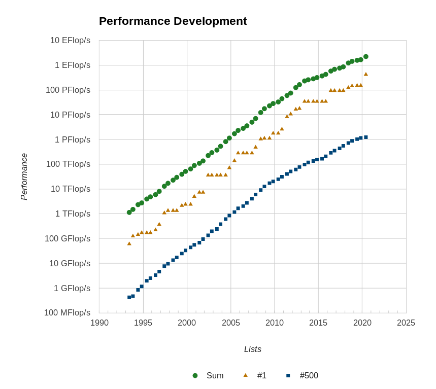
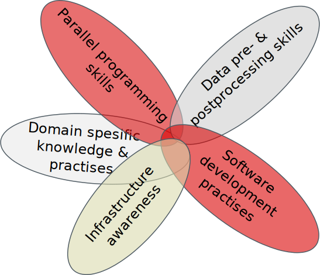

# What is high-performance computing?

- Utilising computer power that is much larger than available in
  typical desktop computer 
- Performance of HPC system (i.e. supercomputer) is often measured in
  floating point operations per second (flop/s) 
    - For software, other measures can be more meaningful
- Currently, the most powerful system reaches ~500 x 1015 flop/s 
  (500 Pflop / s) 

# What is high-performance computing?

 {.center width=30%}

# Top 500 list

 {.center width=50%}

# What are supercomputers used for? {.section}

# Materials science

- New materials
    - Design of meta-materials
    - Hydrogen storage
- New methods for catalysis
    - Industrial processes
    - Air and water purification
- Design of devices from first principles

{.center width=80%}

# Life sciences

- Next-generation sequencing techniques
- Identifying genomic variants associated with common complex diseases
- Understanding the natural development of diseases
- Medical imaging and diagnostics
- Simulated surgeries
- Predicting protein folding

 {.center width=80%}

# Earth sciences

- Long term climate modeling
    - Coupling atmospheric, ocean and land models
    - Understanding and predicting the climate change
- High-resolution weather prediction
    - Predicting extreme weather conditions
    - District-scale forecasts
    - Ensembles
- Whole-Earth seismological models

 
 {.center width=80%}

# Artificial intelligence

- Machine learning
    - deep neural networks
- Large scale data analysis
- Interpreting experimental data
- Prediction of material properties

 {.center width=80%}

# Utilizing HPC in scientific research

 {.center width=40%}

# What are supercomputers made of? {.section}

# CPU frequency development 
- Power consumption of CPU: `~`f^3

 {.center width=60%}

# Parallel processing

- Modern (super)computers rely on parallel processing
- **Multiple** CPU cores
    - `#`1 system has `~`10 000 000 cores
- Vectorization
    - Single instruction can process multiple data (SIMD)
- Pipelining
    - Core executes different parts of instructions in parallel 
- Accelerators
    - GPUs

# Anatomy of supercomputer

- Supercomputers consist of nodes connected with high-speed network
    - Latency `~`1 µs, bandwidth `~`200 Gb / s
- A node can contain several multicore CPUS
- Additionally, node can contain one or more accelerators
- Memory within the node is directly usable by all CPU cores

 {.center width=60%}

# Supercomputer autopsy – Sisu.csc.fi

 {.center width=80%}

# From laptop to Tier-0

 {.center width=80%}

- The most fundamental difference between a small university cluster
  and Tier-0 supercomputer is the number of nodes 
    - The interconnect in high end systems is often also more capable

# Cloud computing

- Cloud infrastructure is run on top of normal HPC system:
    - Shared memory nodes connected by network
- User obtains **virtual** machines
- Infrastructure as a service (IaaS)
    - User has full freedom (and responsibility) of operating system
      and the whole software environment 
- Platform as a service (PaaS)
    - User develops and runs software within the provided environment

# Cloud computing and HPC

- Suitability of cloud computing for HPC depends heavily on application
    - Single node performance is often ok
- Virtualization adds overhead especially for the networking
    - Some providers offer high-speed interconnects with a higher price
- Moving data out from the cloud can be expensive
- Currently, cloud computing is not very cost-effective solution for
  most large scale HPC simulations 

# Future of High-performance computing {.section}

# Exascale challenge

- Performance of supercomputers has increased exponentially for a long time
- However, there are unprecedented challenges in reaching exascale 
  (1 x 1018 flop/s) 
    - Power consumption: scaling current `#`1 energy efficient system
      would still require `~`60 MW 
    - Fault tolerance: with current technology exascale system
      experiences hardware failure every few hours 
    - Application scalability: how to program for 100 000 000 cores?

# Quantum computing

- Quantum computers can solve certain types of problems exponentially
  faster than classical computers 
- General purpose quantum computer is still far away
- For optimisation problems, D-Wave computer based on quantum
  annealing is already commercially available 

